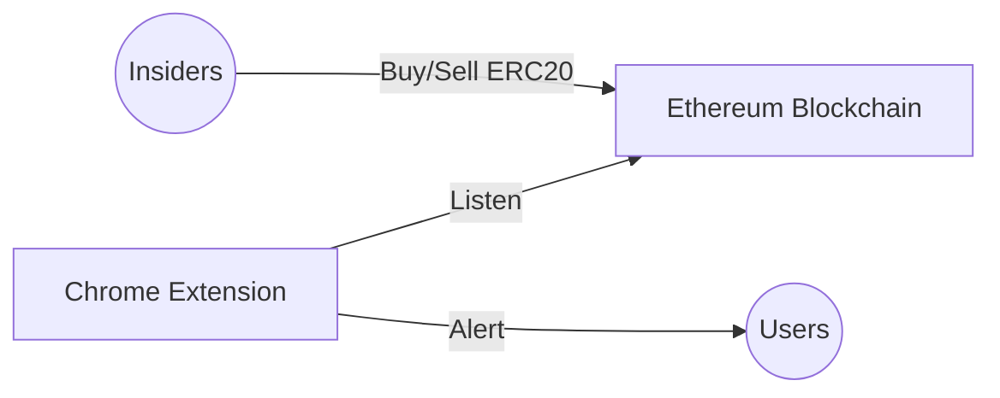

## Welcome to the InsideX project
InsideX enables you to monitor transactions by top holders (so called *insiders*) of your favorite token(s).

If the advisors/team leaders of a ERC20 project start dumping their coins, will you remain invested? Probably not. Do you know when they do so? Probably not... except if you have this Chrome extension installed: it will alert you whenever *insiders* make large transactions.

Requires that the team behind your favorite ERC 20 uses a DEX... but he, shouldn't they if they have nothing to hide? Else you should already be out.

### See what it looks like: install the extension on your local machine

1.  Navigate to  `chrome://extensions`  in your browser. You can also access this page by clicking on the Chrome menu on the top right side of the Omnibox, hovering over  **More Tools**  and selecting  **Extensions**.
2.  Check the box next to  **Developer Mode**.
3.  Click  **Load Unpacked Extension**  and select the directory for the "InsideX" extension.

Congratulations! You can now use your popup-based extension by clicking the InsideX icon at the top right of your navigator.

### Architecture
And this is how it works:

### Contribute & Contact

There are still some things to fix before InsideX is production ready. Check the issues section of this repo!

This extension mimicks the *regular* finance disclosure requirements for companies' insiders (the board members for instance). Except here the disclosure is automated, technologically enforced, and real time.

All contributions are welcome. Get in touch with us at:

https://twitter.com/PhaniPasupula
https://twitter.com/SamuelMartinet
